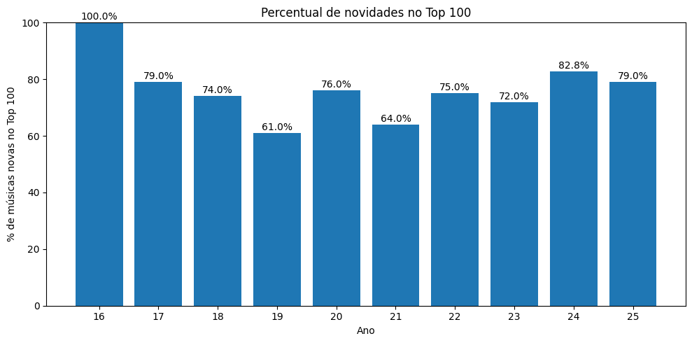

# Evolution of my music listening behavior (2016–2025)

After organizing my Spotify listening history into a yearly Top 100, I explored different metrics to understand **how my music consumption behavior evolved over time**.

The analysis focuses on three main questions:

1. How much of my repertoire **remains stable** between years?  
2. How much **new content** enters each year?  
3. When novelty appears, does it come from **new artists** or **artists I already listen to**?  

These dimensions help separate two different behaviors:

- **exploration** (discovering new artists)  
- **depth** (listening more to artists I already know)

---

# 1. Track recurrence over time

The first metric calculated was the **track survival rate between years**.

It measures:

> What percentage of a given year's Top 100 also appeared in the previous year.

For example:

- from **2016 → 2017**, **21% of tracks remained**  
- meaning **79% of the repertoire changed**

Across most of the timeline, survival rates stayed between **20% and 36%**, but **dropped significantly in recent years**, reaching around **6% from 2024 → 2025**.

This suggests that:

- few tracks remain favorites over long periods  
- my yearly Top 100 is highly dynamic  

At first glance, this indicates **high variability in consumption**.

---

# 2. Musical novelty: how much is actually new?

To complement this, I calculated the percentage of **new tracks entering the Top 100 each year**, where “new” means a track that **never appeared before in the historical data**.

The pattern reinforces the previous finding:

In most years, **around 75% of the Top 100 consists of tracks that never appeared before**.

As expected:

- survival **2016 → 2017 = 21%**  
- novelty **2017 ≈ 79%**

The numbers are consistent.

But this raises a more interesting question:

> does this novelty represent true discovery, or just variation within familiar artists?

---

# 3. New tracks ≠ new artists

To answer that, I measured the **entry of new artists per year**, meaning artists that had **never appeared before in the dataset**.

In the early years, artist discovery is naturally high.

Over time, it stabilizes around:

**40%–45%**

This indicates that my listening behavior gradually consolidates around a **relatively stable core of artists**.

There are some deviations:

- **2024 (~64%)** → a year of higher exploration  
- **2025 (~39%)** → a more conservative phase  

So even with many new tracks entering each year:

> the **artist base tends to stabilize over time**

---

# 4. Where do new tracks come from?

To better understand novelty, I split new tracks into two categories:

1. new track from a new artist  
2. new track from a known artist  

On average:

- **60%–70%** of new tracks come from new artists  
- **30%–40%** come from artists I already listen to  

This shows a combination of:

- exploration  
- reinforcement of existing preferences  

Some years highlight this dynamic:

- **2022** → only ~30% from new artists → strong “depth” behavior  
- **2023** → ~68% → strong exploration phase  

---

# 5. Artist dominance and listening phases

To understand how artists shape different periods, I built a matrix of **track counts per artist per year**.

Clear patterns emerge:

- **Dead Fish** dominates the early years  
- artists like **Raul Seixas** and **Sérgio Sampaio** appear in specific peaks  
- newer artists emerge as new “waves” in the dataset  

This shows that my listening history is not random — it is structured in **distinct phases of influence**.

Despite these shifts, there is a clear underlying consistency in taste.

---

# 6. Long-lasting tracks

I also analyzed tracks that appear **multiple times across different years**.

Some tracks show strong longevity, acting as anchors in my listening behavior.

However, an interesting recent pattern emerges:

> in the last two years, very few of the earlier “core tracks” remain

This suggests a **renewal phase within an already established taste profile**.

---

# Key takeaways

Looking across 10 years of data:

- my listening shows **high track-level turnover**  
- there is a constant inflow of new content  
- but the artist base tends to **stabilize over time**  

In practice:

> I don’t change my taste that much — I **deepen within it**.

Most exploration happens **around the edges of what I already like**, rather than through radical shifts.

---

# Final note

This analysis focuses on **behavioral patterns**, rather than genre-based classification.

While enriching the dataset with genres could add another layer of insight, the current approach already provides a strong view of:

- how novelty enters the system  
- how preferences stabilize  
- how exploration and repetition coexist over time  

---

# Next steps

Possible extensions of this analysis include:

- measuring how long tracks remain relevant  
- modeling artist lifecycle within the dataset  
- quantifying exploration vs repetition more formally  