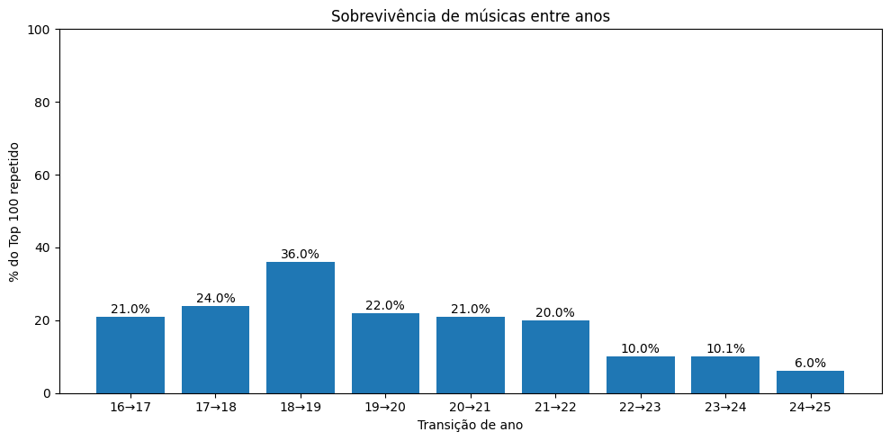
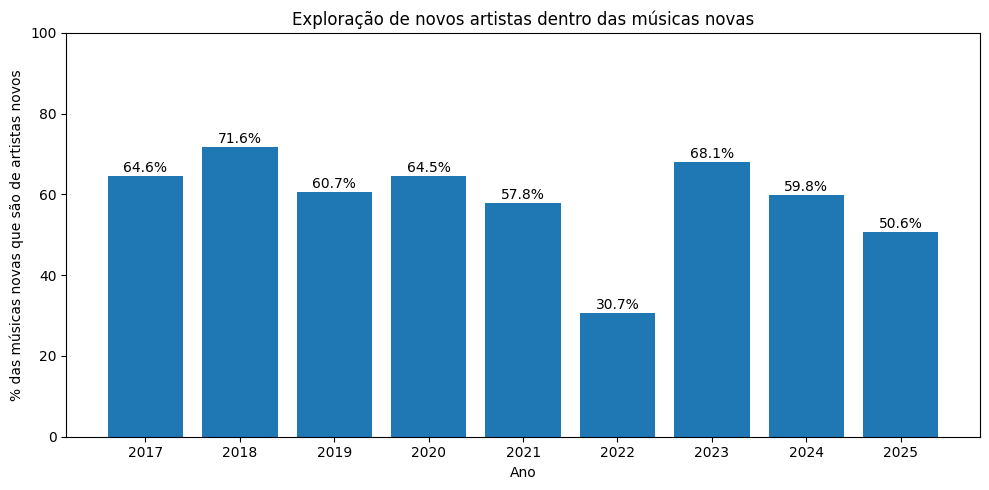
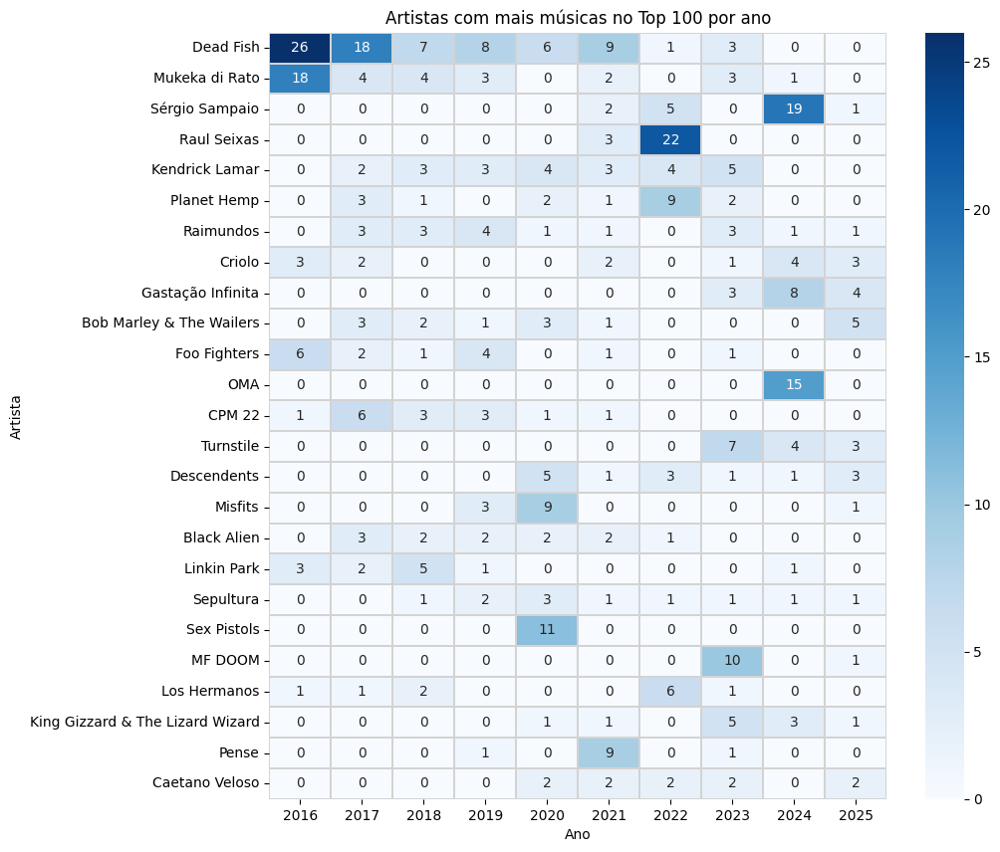
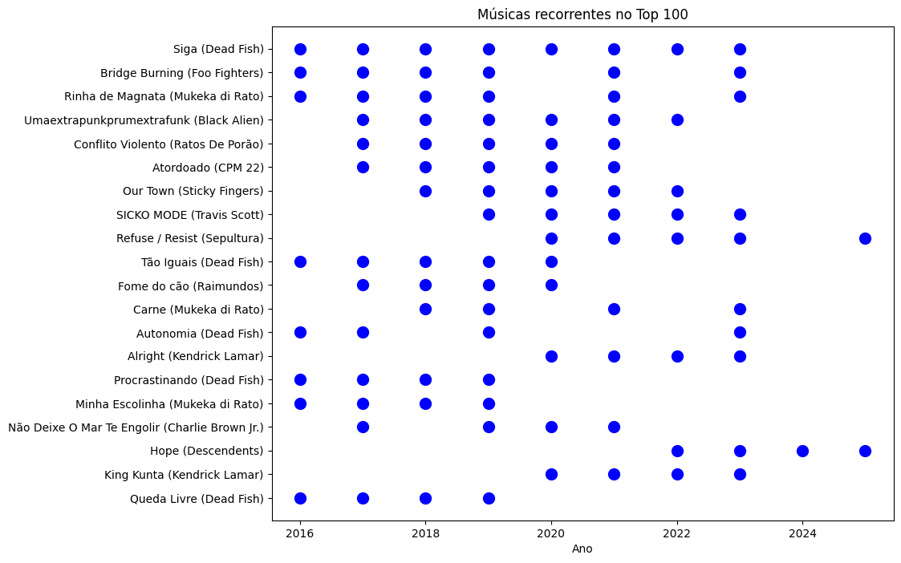

# Evolução do meu repertório musical (2016–2025)

Após organizar meu histórico de escuta do Spotify em um Top 100 anual, explorei diferentes métricas para entender **como meu gosto musical evolui ao longo do tempo**.

A análise buscou responder principalmente três perguntas:

1. Quanto do meu repertório **permanece estável** entre anos?
2. Quanto **novo repertório** entra a cada ano?
3. Quando surge novidade, ela vem de **artistas novos** ou de **artistas que eu já escutava**?

Essas dimensões ajudam a separar dois comportamentos diferentes:

- **descoberta musical real** (novos artistas)
- **aprofundamento de repertório** (novas músicas de artistas já conhecidos)

---

# 1. Recorrência de músicas entre anos

A primeira métrica calculada foi a **taxa de sobrevivência de músicas entre anos**.

Ela mede:

> Qual porcentagem do Top 100 de um ano também estava presente no Top 100 do ano anterior.

Por exemplo:

- na transição **2016 → 2017**, cerca de **21% das músicas permaneceram**
- portanto **79% do repertório mudou**

Durante boa parte da série histórica, a sobrevivência ficou entre **20% e 36%**, mas **caiu significativamente nos anos mais recentes**, chegando a cerca de **6% na transição 2024 → 2025**.

Isso indica que:

- poucas músicas permanecem favoritas por muitos anos
- meu Top 100 anual tende a se renovar com frequência

À primeira vista, isso sugere **expansão constante do repertório**.

---

# 2. Novidade musical: quantas músicas realmente entram no repertório

Para complementar essa leitura, calculei o percentual de **músicas novas no Top 100 de cada ano**, considerando como nova qualquer música que **nunca apareceu antes no histórico**.

Os resultados reforçam o padrão de renovação:

Ou seja, na maioria dos anos **cerca de três quartos do meu Top 100 é composto por músicas que nunca haviam aparecido antes**.

Ps: as duas métricas se complementam matematicamente do primeiro pro segundo ano (16 -> 17)

- sobrevivência **2016 → 2017 = 21%**
- novidade **2017 ≈ 79%**

Isso confirma a consistência do cálculo.

---

# 3. Novidade de artistas: explorar música não é o mesmo que explorar artistas

No entanto, existe um ponto importante:

> música nova não significa necessariamente artista novo.

Para investigar isso, medi também a **entrada de novos artistas no Top 100 de cada ano**, ou seja, artistas que **nunca haviam aparecido antes no histórico**.

Nos primeiros anos, a descoberta de artistas foi naturalmente alta:

Com o passar do tempo, essa taxa se estabilizou na faixa de:

**40% – 45%**

Isso indica que meu repertório passou a se consolidar em torno de um **conjunto relativamente estável de artistas**.

Um ponto fora da curva aparece em **2024**, quando a taxa sobe novamente para cerca de **64%**, indicando um ano de maior exploração musical.

Já **2025 retorna ao menor valor da série (~39%)**, sugerindo um movimento de consolidação do repertório.

---

# 4. De onde vêm as músicas novas?

Para aprofundar essa análise, separei as músicas novas em duas categorias:

1. **música nova de artista novo**
2. **música nova de artista já conhecido**

Ou seja, mesmo quando uma música aparece pela primeira vez no meu histórico, ela pode vir de:

- um artista que estou descobrindo
- um artista que já faz parte do meu repertório

O padrão geral foi relativamente estável:

Em média:

- **60% a 70% das músicas novas vêm de artistas novos**
- **30% a 40% vêm de artistas já conhecidos**

Isso indica que grande parte da expansão do meu repertório ocorre através da **descoberta de novos artistas**, não apenas explorando discografias já conhecidas.

Alguns anos se destacam.

O caso mais curioso foi **2022**.

Nesse ano, apenas **~30% das músicas novas vieram de artistas novos**, o menor valor da série. Ou seja, naquele período eu estava:

- ouvindo músicas novas
- mas **principalmente de artistas que já conhecia**

Isso sugere um comportamento de **aprofundamento no repertório existente**.

Já **2023 apresenta o movimento oposto**, com cerca de **68% das músicas novas vindas de artistas novos**, indicando forte exploração de novos artistas.

---

# 5. Artistas dominantes ao longo dos anos

Para entender quais artistas moldaram diferentes fases do meu repertório, construí uma matriz mostrando **quantas músicas de cada artista aparecem no Top 100 de cada ano**.

Alguns padrões ficam claros:

**Dead Fish** domina fortemente os primeiros anos da série, chegando a:

- **26 músicas no Top 100 em 2016**
- **18 em 2017**

Isso indica um período de grande concentração do meu repertório em torno da banda.

Outros artistas aparecem em **picos temporais**, sugerindo fases específicas de exploração:

- **Raul Seixas** com forte presença em 2022
- **Sérgio Sampaio** dominando 2024
- **Omar Apollo** com forte presença em 2024
- **Gastação Infinita** emergindo nos anos recentes

Essa matriz ajuda a visualizar **ondas de influência artística** ao longo do tempo.

---

# 6. Músicas mais recorrentes do repertório

Por fim, analisei também quais músicas aparecem **repetidamente ao longo dos anos** no Top 100.

Algumas faixas mostram **longevidade notável**, aparecendo em vários anos diferentes.

Entre elas:

- **Siga — Dead Fish**
- **Bridge Burning — Foo Fighters**
- **Rinha de Magnata — Mukeka di Rato**
- **Umaextrapun... — Black Alien**
- **Conflito Violento — Ratos de Porão**
- **Autonomia — Dead Fish**

Essas músicas funcionam quase como **pilares do meu repertório**, retornando repetidamente ao longo dos anos.

Isso indica que, apesar da alta rotatividade anual do Top 100, **algumas músicas permanecem como favoritas duradouras**.

---

# Conclusões até aqui

Juntando todas as métricas analisadas, surge um padrão relativamente claro:

Ao longo dos anos:

- meu repertório anual muda bastante
- muitas músicas novas entram no Top 100
- mas o conjunto de artistas tende a **se estabilizar ao longo do tempo**

Ou seja, parte da novidade vem de **aprofundar em artistas que já fazem parte do meu gosto**, não apenas descobrir artistas completamente novos.

Isso é um comportamento bastante natural: conforme os anos passam, eu consolido um conjunto de artistas que realmente me agradam e passo a explorar **novas músicas — ou músicas antigas — dentro desse mesmo universo musical**.

Ainda assim, existem momentos de **expansão real do repertório**, como aconteceu em 2024, quando a entrada de novos artistas aumentou significativamente.

---

# Próximos passos da análise

Até aqui a análise explorou:

- recorrência de músicas
- novidade musical
- descoberta de artistas
- artistas dominantes por período
- músicas mais recorrentes

Essas dimensões ajudam a entender **como meu gosto musical evolui ao longo do tempo**.

Nos próximos passos, a ideia é aprofundar perguntas como:

- quanto tempo uma música costuma permanecer no meu repertório
- como ciclos de artistas surgem e desaparecem ao longo dos anos
- qual é o equilíbrio entre **exploração** e **recorrência** no meu consumo musical

Essas perguntas ajudam a investigar o objetivo central do projeto:

> medir o quão **eclético** (ou não) é o meu consumo musical ao longo da última década.